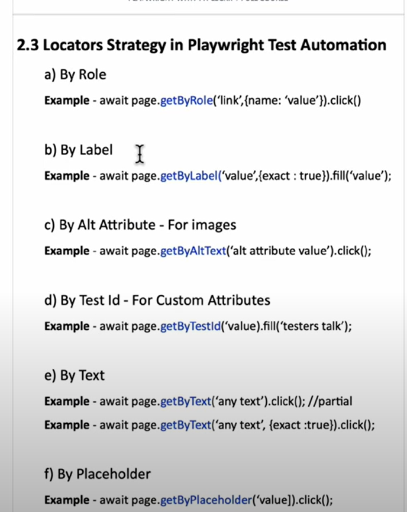

Instalar Playwright rapido en VS code:
    Dentro de VS code pulsa ctr + shift + p
    Escribe "playwright" y selecciona "Playwright: Install Playwright"

Instalar playwright desde consola:
    Comando: npm init playwright@latest
    Elegir entre typescript o JS (Por defecto viene TS)
    Ponle nombre a tu carpeta de test (Por defecto es "tests")
    Añade github action
    Instala los navegadores (Por defecto aparece en true y se instalan solos)

npx playwright test
    Runs the end-to-end tests.

npx playwright test --ui
    Starts the interactive UI mode.

npx playwright test --project=chromium
    Runs the tests only on Desktop Chrome.

npx playwright test example
    Runs the tests in a specific file.

npx playwright test --debug
    Runs the tests in debug mode.

npx playwright codegen
    Auto generate tests with Codegen.

Para ejecutar solo un archivo de test debemos lanzar en consola el comando: npx playwright test nombreCarpeta/nombreArchivo

Para abrir el codegen y grabar el test y que genere el codigo automaticaticamente lanzar el comando npx playwright codegen

Tipos de locators:
